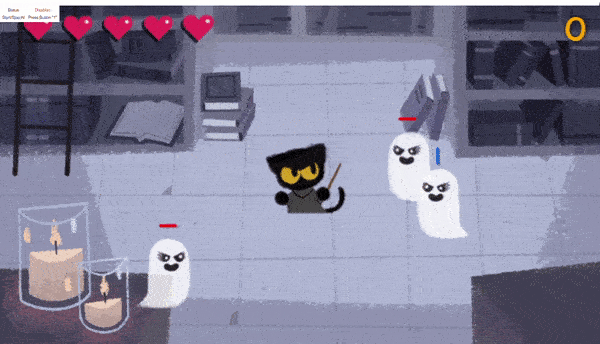

# Halloween Doodle Bot

<p align="center">
    
</p>

## Installation

1. Copy the repo

```bash
git clone https://github.com/liketurbo/halloween-doodle-2016-bot.git
```

2. Install dependencies

```bash
yarn # or npm install
```

3. Build the project

```bash
yarn build # or npm run build
```

## Usage

1. Go to [Halloween 2016](https://www.google.com/doodles/halloween-2016), click the play button 🕹
2. Locate builded `dist/bot.js` file, copy to the clipboard
3. Go back to the page with game, open DevTools paste into the console prompt code from the clipboard, hit the `Enter` 😄
4. Manually finish the game tutorial
5. Click the `Button 1` to _activate_ bot, click again to _deactivate_
